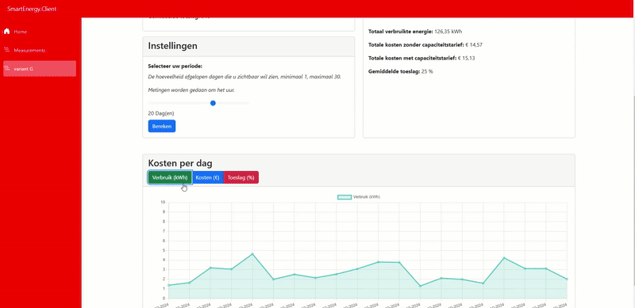
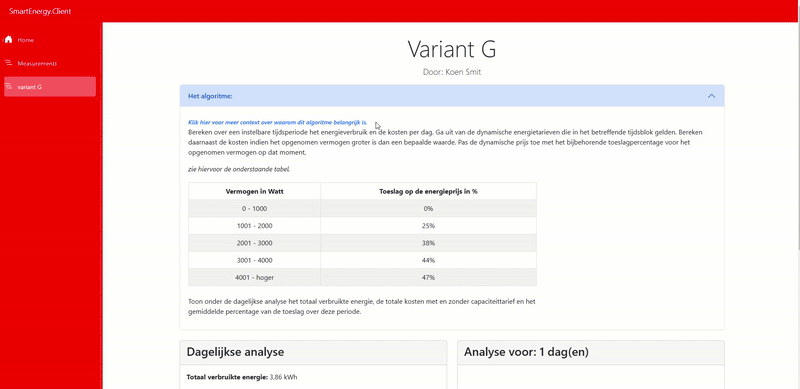
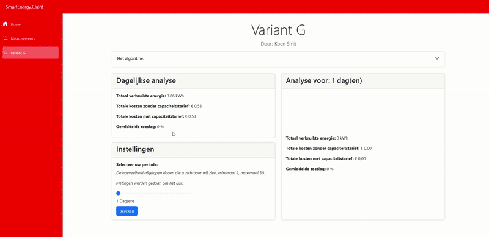

# Jaar 1, Periode 1: ATIx ICT-B1.1 Smart Meter Data Processing (2024-25)
- (04-09-2024 / 01/11/2024)
- Eindpunt: **10**
- **Stack:** Blazor (.NET C#, HTML, CSS, Bootstrap, JavaScript)

## Project Overview
Dit project is het eerste project van mijn opleiding Informatica. De applicatie is ontwikkeld om data te genereren en te visualiseren met behulp van een "Smart Meter". Deze meters voerden metingen uit voor onder andere elektriciteit en gas.

Voor deze opdracht kon gekozen worden uit verschillende varianten, die elk een andere invalshoek en opdracht boden.
- [Geselecteerde opdrachtvariant](Assets/Opdrachtomschrijving/Opdrachtvariant_H.pdf)
- [Handleiding voor het aansluiten van de meter](Assets/Opdrachtomschrijving/Handleiding.pptx)


**Belangrijk**: Deze applicatie kan niet meer correct worden gebruikt, omdat de meters niet langer aangesloten zijn en geen data meer produceren. Bovendien heb ik geen toegang meer tot de door school geleverde database.



### Functionaliteit:
- **Data visualisatie ->** Tabellen en grafieken voor elektriciteitsverbruik en andere gegevens.
- **Dynamische tariefberekeningen ->** Algoritmes om energiekosten te berekenen op basis van realtime tarieven, inclusief toeslagen voor hoog stroomverbruik.
- **Aanpasbare analyse ->** Instelbare tijdsperioden voor gegevensaggregatie en analyse.

### Design opdrachten:
- [Flowchart prototype](Assets/Designs/Flowchart_prototype.pdf)
- [Wireframe prototype](Assets/Designs/Wireframe_prototype.PNG)

---

## Vereisten
Dit project maakt gebruik van een InfluxDB-database om gegevens van de slimme meter op te slaan en op te vragen. Gevoelige gegevens zoals database-URL's, tokens en organisatiedetails moeten op je lokale machine worden geconfigureerd met `.NET user-secrets`.

### InfluxDB instellen:

1. **Open een Command Line Interface (CLI):**
   - Je kunt hiervoor de Command Prompt (CMD), PowerShell of een Bash-compatibele terminal gebruiken.

2. **Navigeer naar de projectmap:**
   ```bash
   cd path_to_your_project/SmartEnergy/SmartEnergy.Client
   ```

3. **Initialiseer User-Secrets:**
   ```bash
   dotnet user-secrets init
   ```

4. **Stel InfluxDB-referenties in:**
   Vervang de placeholders door de juiste waarden:
   ```bash
   dotnet user-secrets set "InfluxDb:Url" "your_influxdb_url"
   dotnet user-secrets set "InfluxDb:Token" "your_influxdb_token"
   dotnet user-secrets set "InfluxDb:Org" "your_influxdb_organization"
   ```

---

## Applicatiestructuur
Het project is opgedeeld in twee hoofdcomponenten:

### 1. **SmartEnergy.Client**
   - Een Blazor-gebaseerde webapplicatie die verantwoordelijk is voor de frontend-functionaliteit.
   - Gebouwd met **Bootstrap** voor een grotendeels responsive ontwerp. [Bootstrap Documentation](https://getbootstrap.com/docs/5.1/getting-started/introduction/)




   **Kenmerken:**
   - Interactieve dashboards en bedieningspanelen voor het aanpassen van tijdsperioden.
   - Dynamische grafieken om verbruik, kosten en toeslagen te visualiseren.

### 2. **SmartEnergy.Library**
Naast een paar aanpassingen voornamelijk geleverd door school!
   - Bevat de backend-logica voor het opvragen en verwerken van gegevens uit de database.
   - Handelt API-aanroepen af om "slimme meter"-metingen op te halen.

---

## Ontwikkelomgeving

### Run Profiles
- **Debug Mode:** Hiermee kunnen breakpoints worden gebruikt voor het debuggen van de backend, maar de applicatie moet opnieuw worden gestart na codewijzigingen.
- **Hot Reload:** Vernieuwt de browser automatisch na codewijzigingen, maar ondersteunt geen breakpoints.

---

## Core Algorithm
De applicatie berekent energieverbruik en kosten over een aanpasbare tijdsperiode. Er worden dynamisch toeslagen toegepast op basis van drempelwaarden voor stroomverbruik. Een paar belangrijke berekeningen:

- **Total Usage (kWh):** Geaggregeerd over de geselecteerde tijdsperiode.
- **Base Cost:** Berekend op basis van dynamische energietarieven.
- **Toeslag:** Progressief toegepast volgens de volgende drempelwaarden:
  
  | Power Usage (Watt) | Surcharge (%) |
  |--------------------|---------------|
  | 0 - 1000           | 0%            |
  | 1001 - 2000        | 25%           |
  | 2001 - 3000        | 38%           |
  | 3001 - 4000        | 44%           |
  | > 4000             | 47%           |

---

## Gebruiksvoorbeeld
De volgende code laat de hoofdlogica zien:

```csharp
private List<double?> CalculatePrice(List<Measurement> measurements, string aggregationWindow)
{
    if (measurements == null || measurements.Count == 0)
    {
        return new List<double?> { 0, 0, 0, 0 };
    }

    double totalUsage = 0;
    double totalPriceNoAddition = 0;
    double totalPrice = 0;
    double totalSurchargePercentage = 0;
    int surchargeCount = 0;
    object lockObject = new object();

    double timeFactor = aggregationWindow switch
    {
        "20s" => 20.0 / 3600.0,
        "5m" => 5.0 / 60.0,
        "1h" => 1.0,
        _ => throw new ArgumentException("Invalid aggregation window")
    };

    Parallel.ForEach(measurements, measurement =>
    {
        if (measurement.Value == null || measurement.EnergyPrice == null || measurement.Value <= 0 || measurement.EnergyPrice <= 0)
        {
            return;
        }

        double kiloWattValue = measurement.Value.Value / 1000;
        double surchargePercentage = measurement.Value > 4000 ? 0.47 :
                                      measurement.Value > 3000 ? 0.44 :
                                      measurement.Value > 2000 ? 0.38 :
                                      measurement.Value > 1000 ? 0.25 : 0;

        double adjustedEnergyPrice = measurement.EnergyPrice.Value * (1 + surchargePercentage);
        double priceChangeWithSurcharge = adjustedEnergyPrice * kiloWattValue * timeFactor;

        lock (lockObject)
        {
            totalUsage += kiloWattValue;
            totalPriceNoAddition += measurement.EnergyPrice.Value * kiloWattValue * timeFactor;
            totalPrice += priceChangeWithSurcharge;
        }
    });

    double averageSurchargePercentage = surchargeCount > 0 ? totalSurchargePercentage / surchargeCount * 100 : 0;
    return new List<double?> { totalPrice, totalPriceNoAddition, totalUsage, averageSurchargePercentage };
}
```
---


---

## Beperkingen
- De applicatie kan niet functioneren zonder een actieve verbinding met de InfluxDB-database. 
- Ontworpen als een prototype.


Ik zou de database graag aanpassen naar een lokale versie om testdata op te halen. Echter, ik zie hier weinig uitdaging in, en andere projecten hebben mijn grotere interesse en prioriteit. Bovendien is de functionaliteit hier al goed gedocumenteerd.

---
